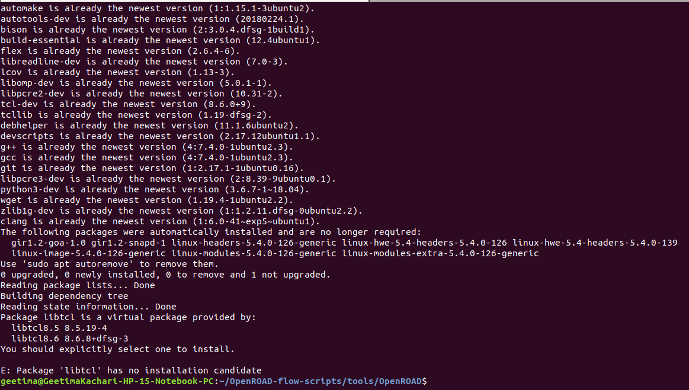
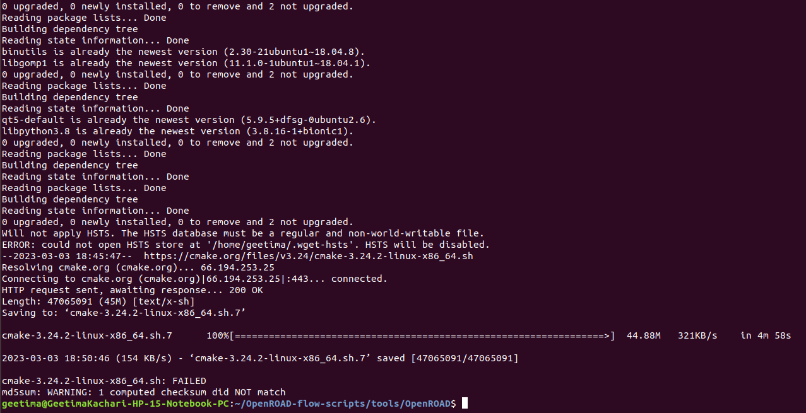

# OpenROAD 7nm design contest

This repository gives an insight of my experience in the OpenROAD ASAP7 (7nm) physical design contest organise by VSD and OpenROAD which was held from 15 March 2023 to 31st March 2023. In this contest I have used both cloud as well as my local system in exploring available design ibex and other a RISCV based design rvmyth which is built duing the RISCV Myth workshop organised by VSD and its details is available [here](https://github.com/shivanishah269/risc-v-core). 

Prior moving ahead towards the contest problem, let me take you along to my installation journey, give you a picture of the issues I encountered and the actions taken to resolve the issues.

My system configuration
1. 4 cpu core and 4GB Ram
2. Ubuntu 18.04

The Openroad tool can be build locally or with a docker. I have build the tool locally. The steps involve in building the tool locally and the issues faced will be discussed as and when encountered . For latest build locally, visit [here](https://openroad-flow-scripts.readthedocs.io/en/latest/user/BuildLocally.html) and using docker [click](https://openroad-flow-scripts.readthedocs.io/en/latest/user/BuildWithDocker.html). 

Build locally 

1. git clone --recursive https://github.com/The-OpenROAD-Project/OpenROAD-flow-scripts
2. cd /home/geetima/OpenROAD-flow-scripts/tools/OpenROAD
3. sudo ./etc/DependencyInstaller.sh
4. ./build_openroad.sh --local
During stage 3 and stage 4 stage I faced few issues as discussed below
5. source setup_env.sh

Step 5 is required each time we want to use Openroad and it can be avoided by setting the environment in the .bashrc file.

Stage3 issues

a. The issue as shown in the figure says that "E: package 'libtcl' has no installation candidate 

Steps taken : 

First installed the libtcl8.6 as shown in figure. However the issue persisted. This happens as ubuntu 18.04 has two different version of libtcl 8.5 and 8.6 which result in the issue shown.

The issue was resolve by making slight change in the dependenciesInstaller.sh. We separated the libtcl installation into different apt-get line and also ensured that if libtcl does not work the installation can find the libtcl8.6 and continue with the installation.
   
     

b. The next issue as shown in figure below was in cmake download which gets broken and can be due to network connection. 

Steps taken: 

cmake downloaded separately and the issue continued. The first download was broken and whenever it tried instead of overwriting or continuing it renames the cmake file to 2,3 and the final trial is 7. It checks the original download thereafter and hence the issue remained.

We decided to change the wget call in the dependenciesInsatller.sh script. I have included the -c (continue) flag whenever wget is use for downloading and the issue resolved. 
 
    

Stage4 issues

c. The next issue occurred while executing the build_opneroad.sh which resulted in my system hang and I am completely unable to use my system.

Steps taken:

My system with 4GB RAM was unable to handle the load while executing the build script of OpenROAD

We first shifted to xfce desktop environment ``apt-get install xfce4``` This did not not help with the issue

Next using the ``top`` command I monitored my system as suggested and we decided to increase the swap area

To increase swap space type in the following commands

```bash 
sudo dd if=/dev/zero of=/swap_file bs=1GB count=6 
```
		     
Now, set the permission access for the users as 600 so users couldn’t be able to read important data from the swap_file:

bash sudo chmod 600 /swap_file```
		    
To enable the swap area on the file “swap_file,” use the “mkswap” command utility:
                      
```bash 
sudo mkswap /swap_file
```

The next step is to enable the swap file “swap_file” using the command:
	    
```bash 
sudo swapon /swap_file 
```
         
Each time the system is rebooted the swap_file has to be enable using the above command. Increasing the swap area assisted in completion of OpenROAD build and it was ready to use.

d. The next issue occured while testing the recommended ibex design for PnR flow. As shown in the figure a parsing error is shown. The error is due to clash with the yosys version.


Steps taken:

The older version of yosys 0.7 is removed and the environment is setup to use the Openroad yosys.

## Complete RTL to GDS flow experience

	Inorder to be familiar with the Openroad flow I implemented gcd design using ASAP7 platform. The design being a simple one was fully executed smoothly within 5min18 sec. Now as the contest requirement ask optimization in run time for anyone of the RISCV based design ibex, riscv32i, swerv I had chosen ibex and at this point lets check out the problem statement.

### Problem statement

1. To reduce the run time of the ibex design based on a given system configuration

	After the successful build of Openroad I also tried executing the ibex design with default configuration for ASAP7 platform and it was a smooth sailing till the global routing stage. At the detail routing stage the optimization iteration till the 20\% of the 1st iteration had taken 11 hrs for execution and the execution stopped due to system shutdown. My main goal at that point of time was to somehow reduce the time taken for optimization iteration during the detail routing stage. 

The first thing I did was to opt for cloud based labs as my system was performing very slow. In the cloud based system the ibex design with its default configuraion had taken around 1 hr 46 minutes to complete the rtl to gds flow. Next thing we decided to increase the swap area to about 10GB in my local system and the 0th iteratipn did was  Now we tried by increasing the swap area to 10GB with available disk space of 35GB and there was slight inprovement as 

The first thing done is to increase the swap area to 10GB and the available disk space is around 35GB and it has shown much improvement during the detail routing stage and the 0th iteration completed in 04:36:31 time and the 1st iteration till 60% has taken around 10hrs. Later checkpoint is included in the detail_route script and the respective asap7 config files as an additional arguments as shown in the snapshot. The checkpoint is a step forward to work on starting the detail routing stage at the point it stopped which may occur due to shut down of the system. The next step of the work is yet to be completed.


# DESIGN: rvmyth 

Executed in cloud and the system information is included in the snapshot below.


The configuration file and the final result obtained is included in the snapshot below


The clock network and the final routed image is as shown in the figure


# Conclusion

Here the constraint use is the clock period constraint only and other constraints is to be included. I will also try to get a better run time in my system for the available system configuration.

# Acknowledgement
- [Shivani Shah](https://github.com/shivanishah269),Teaching Assistant, VSD Corp. Pvt. Ltd.
- [Kunal Ghosh](https://github.com/kunalg123), Co-founder, VSD Corp. Pvt. Ltd.
- [Phillip Guhring](https://github.com/thesourcerer8), Software architect at Libresilicon Association.
- [Sumanta Kar](https://github.com/Eyantra698Sumanto), Senior Project Technical Assistant, IIT Bombay)
- [Vijayan Krishnan](https://github.com/vijayank88), Senior Application Engineer for OpenROAD Project
 


